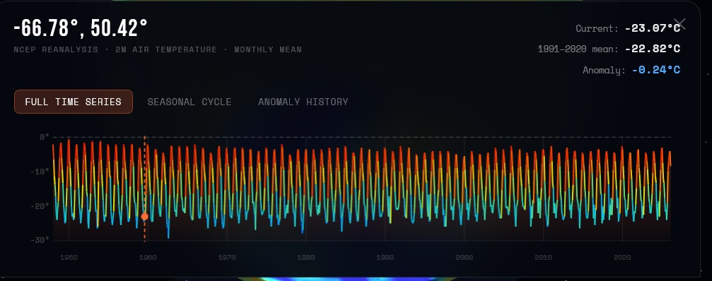
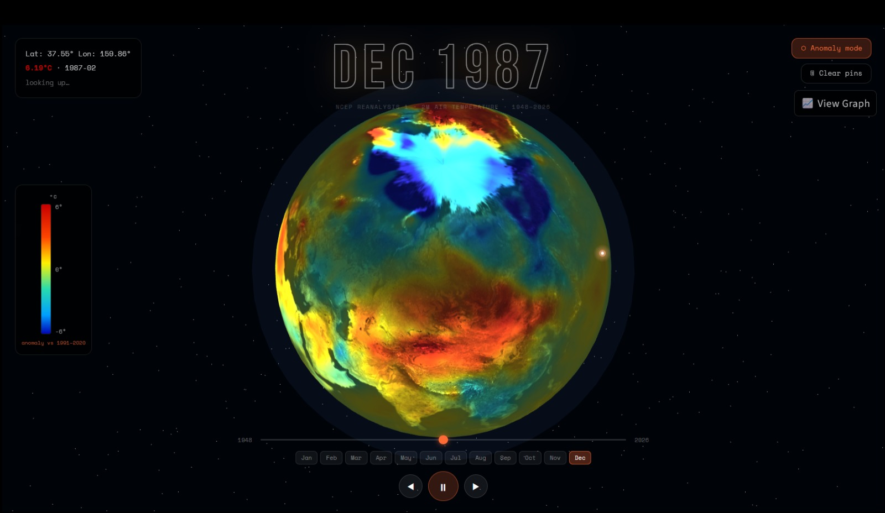

🌍 TEAM-C-LITERALS — Hot Today?

Hot Today? is an interactive globe visualization that allows users to explore global temperature data directly on a 3D Earth model. Users can select any location on the globe to view its coordinates, temperature information, and historical trends.

The project provides two different data views and interactive tools to help users explore climate patterns easily.

✨ Features
🌎 Interactive Globe

A 3D globe interface representing Earth.

Users can click on any location on the globe.

Displays:

Latitude & Longitude

Location name (if available)

📊 Temperature Data Modes

The application provides two temperature visualization modes:

Anomaly Dataset

Shows the temperature deviation from historical averages.

Absolute Temperature

Displays the actual temperature values for the selected month.

Users can switch between these modes dynamically.

📈 Temperature Graph

Toggle a temperature trajectory graph.

Visualizes how the global temperature changes over time.

📍 Pin System

Clicking on the globe places a pin on the selected location.

Pins allow users to explore multiple regions.

Users can:

Clear all pins

Select new locations

🧩 Project Overview

This project aims to provide a visual and interactive way to explore global temperature data through a globe interface.

It helps users:

Understand temperature anomalies

Compare absolute temperatures

Observe temperature trends over time

🛠 Technologies Used

HTML

CSS

JavaScript

Python

Climate Dataset (NetCDF processed into JSON)

🚀 How to Run

Clone the repository

Open the project folder

Run the HTML file in a browser

git clone <repo-link>
cd project-folder
streamlit run app.py

or use the deployed version.

📌 Usage

Open the globe interface.

Click anywhere on the globe.

View:

Coordinates

Location name

Toggle between:

Anomaly dataset

Absolute temperature

Enable the graph to see temperature trajectory.

Clear pins to start exploring new locations.

📷 Preview

👥 Team

TEAM-C-LITERALS
